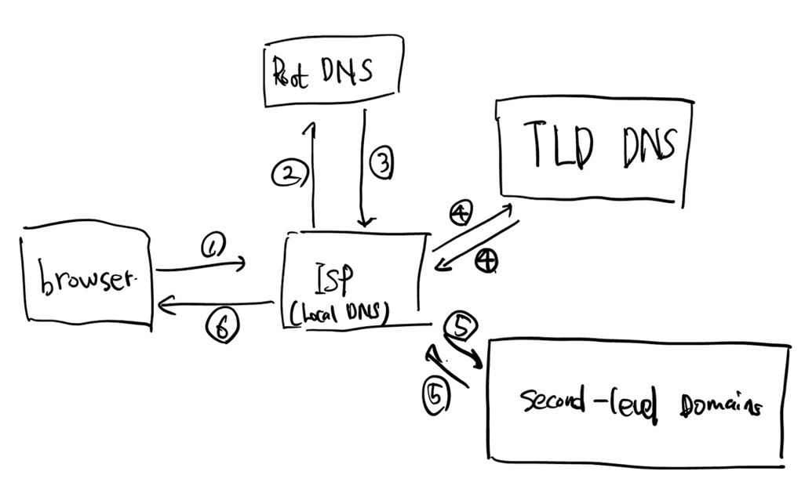

# DNS, 그리고 동작 방식

## DNS란
- 도메인 네임 시스템 (Domain Name System, DNS)은 호스트의 도메인 이름을 호스트의 네트워크 주소로 바꾸거나 그 반대의 변환을 수행 할 수 있도록 하기 위해서 개발되었다.
- 즉 Github IP주소 -> www.github.com 로 이어주는 시스템이다.

## DNS를 사용하는 이유
- IP주소로 웹사이트를 접근하는 것보단 이름으로 접근하는 것이 편하다.
- 컴퓨터는 문자열 보다 숫자열을 더 빨리 습득하기 때문에 전처리 역할을 할 시스템이 필요하다.

## 동작 방식
### 도메인 구조
 

### 동작 흐름

1. 브라우저에서 도메인 이름을 가지고 사용하고 있는 ISP DNS 서버에 도메인 주소에 해당하는 IP를 요청한다.
2. ISP 서버에서는 캐시 데이터가 있다면 주소를 안내하고 아니면 Root DNS 서버에 가야하는 주소를 요청한다.
3. Root 서버는 TLD(그림의 Top-Level Domains) 서버 주소만 관리하기 때문에 edu/gov/com/net 중 포함된 서버로 주소를 안내한다.
4. ISP 서버는 해당 TLD 서버에 IP 주소를 질의하고 해당 도메인을 관리하고 있는 서버를 안내한다.
5. ISP 서버는 해당 도메인을 관리하고 있는 서버에 주소를 요청하고 이 서버는 IP를 알려준다. 이와 동시에 ISP 서버는 해당 정보를 캐시로 등록한다.
6. ISP 서버는 브라우저에 주소를 안내하고 브라우저는 알아낸 IP 주소를 갖고 있는 호스팅 서버에 웹사이트 출력을 요청한다.