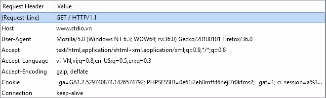

# HTTP란?
### HTTP
- Hyper Text Transfer Protocol로 **인터넷에서 데이터를 주고받을 수 있는 프로토콜**

### 동작 방식

- 클라이언트가 브라우저를 통해서 어떠한 서비스를 URI를 통해 서버에 요청하면 서버에서는 해당 요청에 대한 결과를 응답하는 형태로 동작한다.

### HTTP 요청 메서드
- GET : 특정 리소스의 표시를 요청, GET을 사용하는 요청은 오직 데이터를 받기만 한다.
- HEAD : GET 메서드의 요청과 동일한 응답을 요구하지만, 응답 본문은 포함하지 않는다.
- POST : 특정 리소스에 엔티티를 제출 할 때 쓰인다. 
- PUT : 목적 리소스 모든 현재 표시를 요청 payload로 바꾼다.
- DELETE : 특정 리소스를 삭제한다.
- CONNECT : 요청한 리소스에 대해 양방향 연결을 시작하는 메소드 ,목적 리소스로 식별되는 서버로의 터널을 맺는다.
- OPTIONS : 목적 리소스의 통신을 설정하는 데 사용한다.
- PATCH : 리소스의 부분만을 수정하는데 사용한다.

### HTTP 응답

- Status line 
  - HTTP 프로토콜 버전
  - 상태코드
  - 이유 구문

- Response Header
  - 클라이언트에 추가 정보를 전달하는데 사용한다.

- Response Body
  - 클라이언트가 요청한 리소스 데이터가 포함되어 있다.

참고 : https://developer.mozilla.org/ko/docs/Web/HTTP/Methods , https://www.toolsqa.com/client-server/http-response/