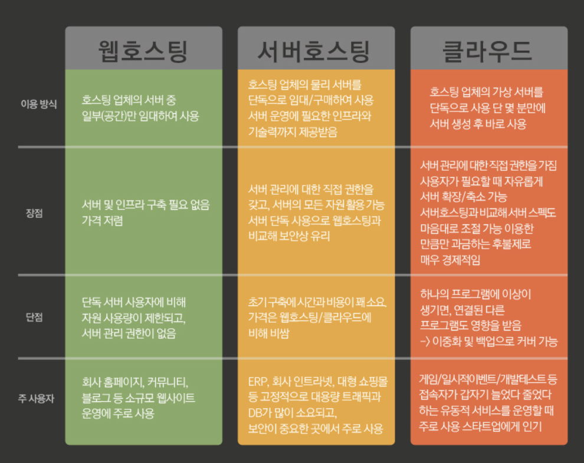

# 호스팅이란?

## 정의
- 어떤 서비스를 빌려서 사용한다는 말로 웹 호스팅은 외부의 대형 서버를 빌려 기능을 사용한다는말을 의미한다.

## 웹 호스팅
- 홈페이지를 올려놓을 인터넷 상의 공간을 임대해주는 서비스

## 서버 호스팅
- 서버 호스팅은 서버 하나를 단독으로 구매/임대하여 서버 운영에 필요한 인프라와 기술력까지 제공받는 서비
- 웹 호스팅에 비해 시간과 비용이 많이 든다. 하지만 보안에 강점이 있다.

## 클라우드 호스팅
- 호스팅 업체의 가상 서버를 단독으로 사용할 수 있는 서비스
- 아마존의 EC2, 구글의 클라우드 플랫폼 등 다양한 서비스가 존재하며 최근 가장 주목을 받고있다.
- 웹 호스팅의 장점과 서버 호스팅의 장점을 모두 가지고 있다.

참고 : https://library.gabia.com/contents/infrahosting/1311/